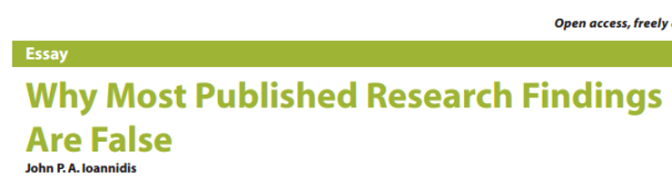
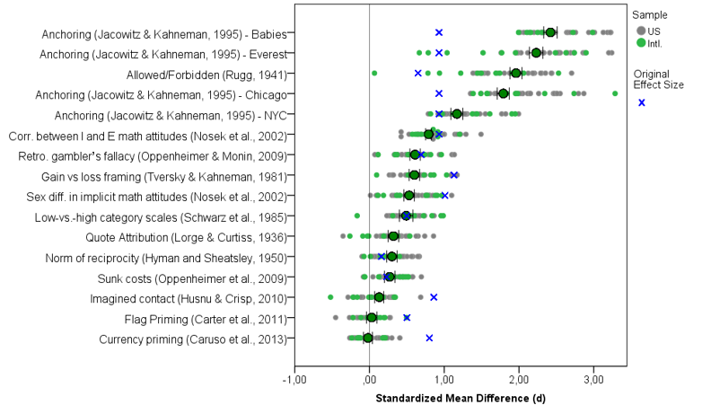

<style type="text/css">
.remark-slide-content {
    font-size: 30px;
    padding: 1em 4em 1em 4em;
}
</style>

```{r setup, include=FALSE}
options(htmltools.dir.version = FALSE)
```

---

class: center, middle

# Many Labs 2
### Investigating Variation in Replicability across Sample and Setting
### Richard Klein
### Univ. Grenoble Alpes

---

# Replication Crisis

--

### Theoretical concern
--

.left[]
.center[]
.right[]

---

# Replication Crisis

### Evidence of a problem

- `Reproducibility Project: Psychology` <small>(OSC, 2015)</small>  
  - ~40/100 replicated
- `Social Sciences Replication Project` <small>(Camerer et al., 2018)</small>
  - 13/21 replicated
- `Multiple large-scale Registered Reports`

---

# Replication Crisis

### Addressing the problem

--

- Many potential causes for replication failures
  - False positives
  - Incompetent replicators
  - Unknown moderators (imprecise theory?)
  - Contextual differences
  - Etc.
--

- Solution depends on the cause
--

- What should we expect of replications? What does replication "look like"? (statistically, practically)

---

# Many Labs Projects

Large collaborations of researchers replicating the same findings. Each project examines a different aspect of replication.

--

- 5 "Many Labs" projects completed or in-progress.
--

- I'm presenting Many Labs 2 (December)
--

- Same thing as Many Labs 1 (2014), but much bigger.
---

# Many Labs Projects

.center[]
---

# Many Labs 2

- <b>Goal: </b>Replicate studies all around the world, compare variation by context/population.
--

- Replicated 28 studies
--

  - Selected for impact, diversity of content, possibility for variation across sites (more at osf.io/8cd4r/)
--

  - Split across two study "packages" due to length
--

  - Computerized in Qualtrics, random presentation order
--

  - Each reviewed by original authors or other experts (Registered Report)
  
---

# Many Labs 1 Map (2014)

.center[]

---

# Many Labs 2 Map (2018)

.center[]

---

background-image: url(images/ml2map.png)
background-size: 700px
background-position: 90% 45%

# Many Labs 2

- 125 samples
- 36 countries
- 16 languages
- 15,305 participants
  
---

background-image: url(images/fig2.png)
background-size: 650px
background-position: 90% 45%

# Results

---

background-image: url(images/fig2.png)
background-size: 650px
background-position: 90% 45%

# Results

- 14/28 successful

---

background-image: url(images/fig2h.png)
background-size: 650px
background-position: 90% 45%

# Results

- 14/28 successful

---

background-image: url(images/fig2h.png)
background-size: 650px
background-position: 90% 45%

# Results

- 14/28 successful
- 21/28 smaller effect
- Med. original <i>d</i> = 0.60
- Med. replication <i>d</i> = 0.15

---

background-image: url(images/fig2h.png)
background-size: 650px
background-position: 90% 45%

# Results

- 14/28 successful
- 21/28 smaller effect
- Med. original <i>d</i> = 0.60
- Med. replication <i>d</i> = 0.15
- (boring)

---

background-image: url(images/fig2h.png)
background-size: 650px
background-position: 90% 45%

# Heterogeneity

---

background-image: url(images/fig2h.png)
background-size: 650px
background-position: 90% 45%

# Heterogeneity

- 11/28 Q < .001
  - Sig. variability

---

background-image: url(images/fig2h.png)
background-size: 650px
background-position: 90% 45%

# Heterogeneity

- 11/28 Q < .001
  - Sig. variability
- HOWEVER:
  - 26/28 Tau ≤ 0.1
  - Often 0
  
---

background-image: url(images/fig2h.png)
background-size: 650px
background-position: 90% 45%

# Heterogeneity

- 11/28 Q < .001
  - Sig. variability
- HOWEVER:
  - 26/28 Tau ≤ 0.1
  - Often 0
- Wait... what?
  
---

background-image: url(images/fig2h.png)
background-size: 650px
background-position: 90% 45%

# Heterogeneity

- 11/28 Q < .001
  - Sig. variability
- HOWEVER:
  - 26/28 Tau ≤ 0.1
  - Often 0
- Wait... what?
- Mostly sampling error
  - N = ~80 per site

---

# Discussion

--
- Low variation across sample/context
  - Despite translation, culture, population differences

--
  - Not reasonable to assume sample moderators; test empirically

--
  - Good news for global collaboration

--
- Furthers understanding of replication
  - Informs power analysis (Kenny & Judd, 2019)

--
- Replication rate aligns with other projects
  - Is this meaningful?

--
- Many studies replicate robustly (and robust replicability is a feasible goal)
  - Failed replications =/= false positive

--
- Open data: [https://osf.io/8cd4r/](https://osf.io/8cd4r/)
  - CC0, free use

---

class: center, middle

# Thanks!

Special thanks to co-leads Fred Hasselman, Michelangelo Vianello, and Brian Nosek + 186 other co-authors.

Great time to get involved (cos.io/about/news/)

<br>
@raklein3 <br>
raklein22@gmail.com <br>
<br>
<br>

&nbsp;&nbsp;&nbsp;&nbsp;&nbsp;&nbsp;
